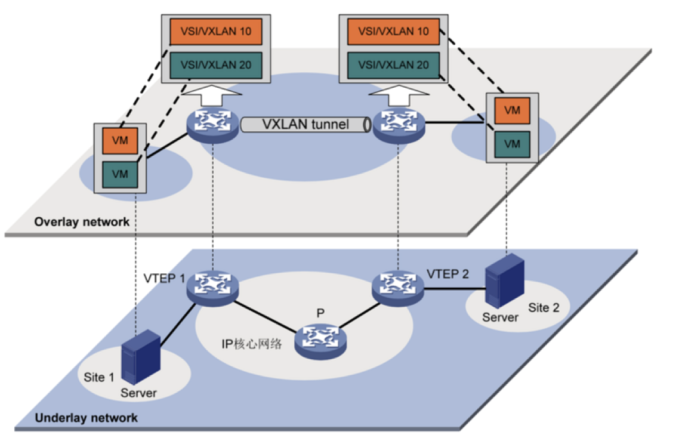
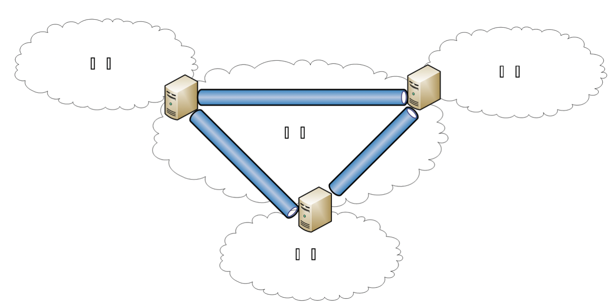
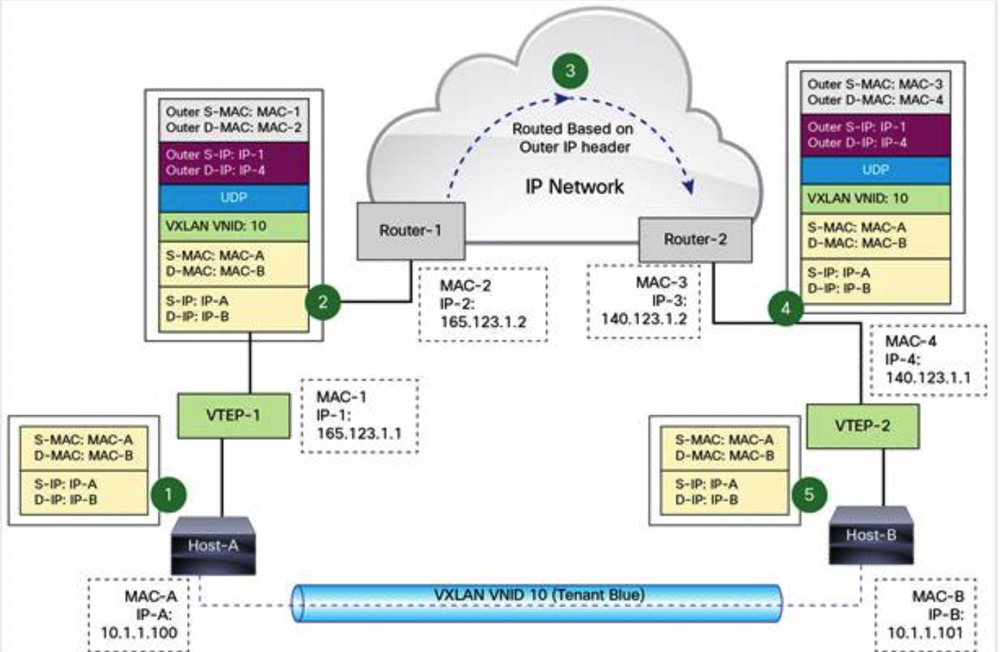

# Overlay

## 概述

Overlay网络有两个作用：

- 把多个独立的L2或L3网络连接成一个L2或L3网络，在此过程中往往通过更上层的L3或L4协议来连接
- 在新连接成的L2或L3网络中，逻辑地隔离出多个虚拟的L2或L3网络

Overlay是指2个独立的X层network在一个标准的Y层network之上（Over）形成一个大的X层network。比如VxLAN的overlay就是在L4 UDP之上形成一个L2的overlay。

### Tunnel

Tunnel是一个虚拟的点对点的连接，提供了一条通路使封装的数据报文能够在这个通路上传输。为创建隧道，隧道的两端必须使用同样的隧道协议。其原理是原packet在A地进行封装，通过网络到达B地后把封装去掉还原成原packet，这样就形成了一条由A到B的通信隧道。

Tunneling本质是在一个packet外封装另一个协议的header用于某一段路程的传输：

- L2 tunneling就是在原packet（L2、L3 header以及data）外添加L2 header，从而使上层看来在L2是联通的（一个节点通过MAC@就可以访问到另一个节点）
- L3 tunneling就是把原packet（L2、L3 header以及data）外添加L3 header，从而使上层看来在L3是联通的（一个节点通过私有IP@就可以访问到另一个节点）

### Overlay网络 vs. 物理网络
Overlay网络指的是一种网络架构（underlay）上叠加的虚拟化技术模式。目前overlay网络都是通过不同技术（VxLAN、NVGRE、STT）把多个L2网络连通。Overlay网络是物理网络向云和虚拟化的延伸，使云资源池化能力可以摆脱物理网络的重重限制，是实现云网融合的关键。

物理服务器通过物理网络设备连接。在物理服务器上可以创建VM，而VM可以属于不同的虚拟网络，所以需要在物理网络（underlay网络）上创建虚拟网络（overlay网络）。Overlay是在传统网络上虚拟出一个虚拟网络来，传统网络不需要在做任何适配，这样物理层underlay网络只对应物理层的计算（物理机、虚拟化层管理网），overlay网络只对应VM（虚拟机的业务IP）。

### 原理

以L2 overlay网络为例，当net1中的server1要与net2中的server2通讯时：

- server1直接使用server2的MAC作为desMAC

- 该packet传到net1的边缘设备后，边缘设备通过tunnel的封装直接把packet传送到net2的边缘设备

- net的边缘设备解压缩后直接通过desMAC传递给server2。

net1、net2的边缘设备起了个L2 switch的作用，通过tunnel让两个不同内网中的设备认为他们在同一个L2或L3的网络中。

 

### 大二层

通过用tunnel封装的方式，将源主机发出的原始L2 frame封装后在现有网络中进行透明传输，从而实现主机之间的L2通信。通过封装和解封装，相当于一个大二层网络叠加在现有的基础网络之上。

## VxLAN

### 简介

把多个L2的网络通过L4 UDP连接，然后再逻辑地分割成多个L2 VxLAN虚拟网络。

VxLAN（Virtual Extensible LAN）是Linux内核本身就支持的一种网络虚似化技术。VxLAN 可以完全在内核态实现上述封装和解封装的工作，构建出Overlay Network。VxLAN 的overlay的设计思想是：在现有的三层网络之上，“覆盖”一层虚拟的、由内核 VxLAN 模块负责维护的二层网络，使得连接在这个 VxLAN 二层网络上的“主机”（虚拟机或者容器都可以）可以像在同一个LAN里那样自由通信。实际上，这些“主机”可能分布在不同的宿主机上，甚至是分布在不同的物理机房里。为了能在二层网络上打通“隧道”，VxLAN 会在宿主机上设置一个特殊的网络设备VTEP作为“隧道”的两端。VTEP的作用是对L2 frame进行封装和解封装。这个工作的执行流程，全部是在内核里完成的（因为 VxLAN 本身就是 Linux 内核中的一个模块）。

VxLAN是一个L4的tunnel协议，它把一个L2的frame封装在一个新的L4 UDP的segment中，从而把两个L2的网络通过公网L4融合，tunnel起到了L2 switch的功能，使这些被封装的frame能在公网的L4中传输，从而实现：

- 多个分布的L2的网络连建成一个大的L2网
- 这个大的L2网络又可以划分为多个逻辑隔离的L2网（VxLAN）

### VNI（VxLAN Network Identifier）

VxLAN采用24比特标识二层网络分段，使用VNI来标识二层网络分段，每个VNI标识一个VxLAN，类似于VLAN ID作用。

### VTEP
VxLAN用于在物理网络上创建tunnel的端点设备称为VTEP（VXLAN Tunneling End Point），用于封装和解封装。在两个VTEP之间完成VxLAN封装报文传输的逻辑隧道。业务L2 frame在入隧道时进行VxLAN头、UDP头、IP头封装后，通过L3转发透明地将封装后的报文转发给远端VTEP，远端VTEP对其进行出隧道解封装处理。

VTEP包含了两个接口：uplink和downlink。Uplink连接underlay网络（内网），downlink连接overlay网络。所以，VTEP可以看成是一个连接overlay和underlay网络的边缘设备。

- 当overlay中VLAN100 frame通过downlink发送至VTEP，会映射到VxLAN ID 1001
- VTEP根据frame的desMAC和刚刚获得的VxLAN ID 1001查找对应的Remote VTEP。
- 如果能找到，把frame封装成VxLAN segment，再通过underlay网络发送到对端的VTEP。
- 对端VTEP收到了VxLAN segment，解封装获得frame，将VxLAN ID与VLAN ID做映射，加入VLAN100的信息，再将frame从overlay发送出去。

这样，两个VTEP下的VLAN 100网络（overlay）相当于是连通的。原始的L2 Frame被封装成了一个UDP segment，数据的传输变成了VTEP之间的UDP传输（underlay），但是这对VLAN100是透明的。

### L3互通

在传统L2网络中，跨VLAN转发需要借助L3设备来完成不同VLAN之间的互通。跨VxLAN网络也需要借助于L3路由设备。

- VxLAN网关：完成VXLAN到VLAN的转换，实体形态可以是vSwitch、物理交换机。

- VxLAN路由器（也称为VxLAN IP GW）：实现不同VxLAN之间的路由，实现可以是一个L3的Router设备，支持跨VxLAN转发，实体形态可以是NFV形态的路由器、物理交换机、物理路由器。

## GRE

把多个L2网络通过L3连接，然后再通过GRE包头中的ID逻辑隔离成多个L2虚拟网络。